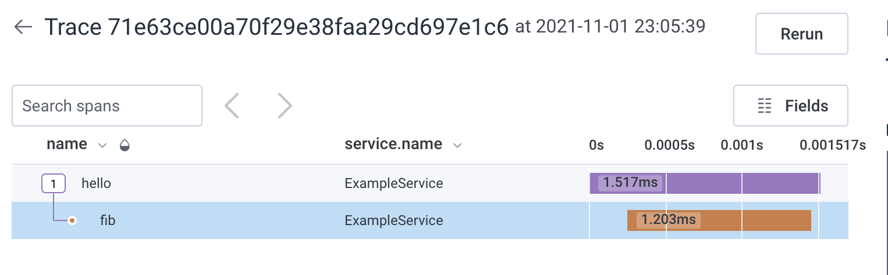

This 'lil thing makes a cute 'lil trace in honeycomb.

I don't know if it's actually the best way to do it, but uhhh, it works?

Critically, it does a few annoying things:

1. Wires up an exporter with gRPC
2. Wires up automatic instrumentation for HTTP calls
3. Constructs a child span from the automatic instrumentation to instrument a silly fibonacci call

It ain't much, but it's tricky boilerplate that will hopefully get obviated with time.

